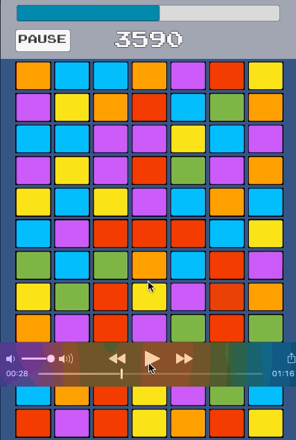

# Unity Cube Line Match 3 - Puzzle Game

Getting Started Game - Proof of Concept  v.1.0.4.



# [Video PlayList](https://www.youtube.com/playlist?list=PLNph7ndeSqE8GtUUGKSLgPERU7Lj6-8YI)


How to make a Match Line 3 Game 
* 24 - Match Line 3 - Auto Remove Link Match Line / Left outer join ( SleepyWings ** )
* 23 - Match Line 3 - Auto Reset 
* 22 - Match Line 3 - PathFinding based algorithm that solves the "kata game of life" of the coding dojo.
* 21 - Match Line 3 - Auto Match Line 3 / IA PathFinding
* 20 - Match Line 3 - Exit Button
* 19 - Match Line 3 - Fade Out 
* 18 - Match Line 3 - Testing Auto Match Horizontal - Vertical
* 17 - Fruit Legend - Bug Match **
* 16 - Match Line 3 - End dialog
* 15 - Match Line 3 - Pause Dialog
* 14 - Match Line 3 - Timer Count Down
* 13 - Match Line 3 - Auto Match 3 Vertical - Fruit legends
* 12 - Match Line 3 - Auto Match 3 Horizontal - Fruit legends
* 11 - Match Line 3 - Animation drop cubes
* 10 - Match Line 3 - Match line-link with new drop cubes
* 09 - Match Line 3 - Match with new drop cubes
* 08 - Match Line 3 - Remove line-link cubes w/up touch
* 07 - Match Line 3 - Linked cube w/line & point
* 06 - Match Line 3 - Linked cube w/line
* 05 - Match Line 3 - Line Draw
* 04 - Match Line 3 - Reset
* 03 - Match Line 3 - Start Dialog
* 02 - Match Line 3 - Mount Board
* 01 - Match Line 3 - Proof of Concept Mobile
* 00 - Match Line 3 - Proof of Concept Desktop

# [Framework supported by Unity 5.0](https://github.com/vicboma1/FrameworkUnity)
* Context
* Installer
* Configurator
* Injector
* Dispatcher
* Adapter
* Controller
* Command Map
* Reflector
* Mono
* Patterns
* Attributes

# MVC Architecture

## _Puzzle

### State Machine
```
Controller
Model
```

### Input
```
Controller
Model
```
### Board
```
Controller 
Model
View
Adapter
```

### Match
```
Cache
Detector
Iterator
Model
Controller
Manager
```

### Node
```
Animation
Model
View
Adapter
Controller
Factory
Manager
```

### Union
```
Cache
Point
Line Renderer
Adapter
```

## _Score
```
 Model
 View
 Controller
 Adapter
 Manager
```

## _CountDown Time
```
 Controller
```


_______________


## Puzzle Core States
```c#
public enum PuzzleState {
	STAND,
	DROP_NODES,
	FIND_MATCH,
	CLEAR_NODES,
	RESET_ON,
	RESET_OFF,
	PAUSE_ON,
	PAUSE_OFF
}

```

## Puzzle Events

### State Machine 
```c#
event EventHandler OnDropNodesCurrentState;
event EventHandler OnClearNodesCurrentState;
event EventHandler OnFindMatchAutoLineCurrentState;
event EventHandler OnPauseONMatchCurrentState;
event EventHandler OnPauseOFFMatchCurrentState;
event EventHandler OnResetMatchCurrentState;
event EventHandler OnEndResetMatchCurrentState;
```

### Configuration
```c#
event EventHandler OnStartPauseGame;
event EventHandler OnEndPauseGame;
event EventHandler OnNewMatch;
event EventHandler OnInitializeGame;
event EventHandler OnResetMatch;
event EventHandler OnNewCombo;
```

### Core Controller
```c#
event EventHandler OnNodeModelMatch;
event EventHandler OnResetNoAutoMatch;
event EventHandler OnNoLinkAutoMatch;
event EventHandler OnStartTouchFirstNodeModel;
event EventHandler OnEndTouchFirstNodeModel;
event EventHandler OnStartMovimentSameNodeModel;
event EventHandler OnEndMovimentSameNodeModel;
event EventHandler OnEndMovimentDifferentNodeModel;
event EventHandler OnStartMovimentDifferentNodeModel;
```

### Match Controller 
```c#
event EventHandler OnDisposeMatch;
```

### Node Controller
```c#
event EventHandler OnDisposeNode;
```

### Animation Node Controller
```c#
event EventHandler OnCompleteAnimation;
event EventHandler OnStartAnimation;
event EventHandler OnDisposeAnimation;
```


_______________


## Score Event

### Controller
```c# 
event EventHandler OnQuantityNode
```


_______________


## CountDown Time Event

### Controller
```c# 
event EventHandler OnStepCount;
event EventHandler OnEndCount;
event EventHandler OnStop;
event EventHandler OnStart;
```
